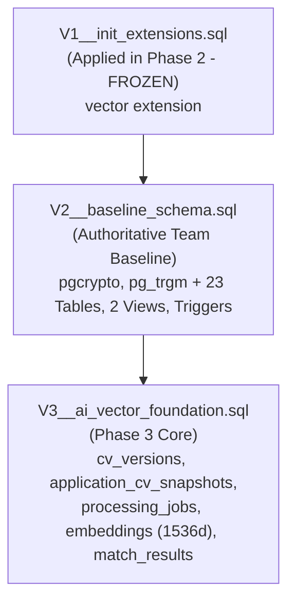
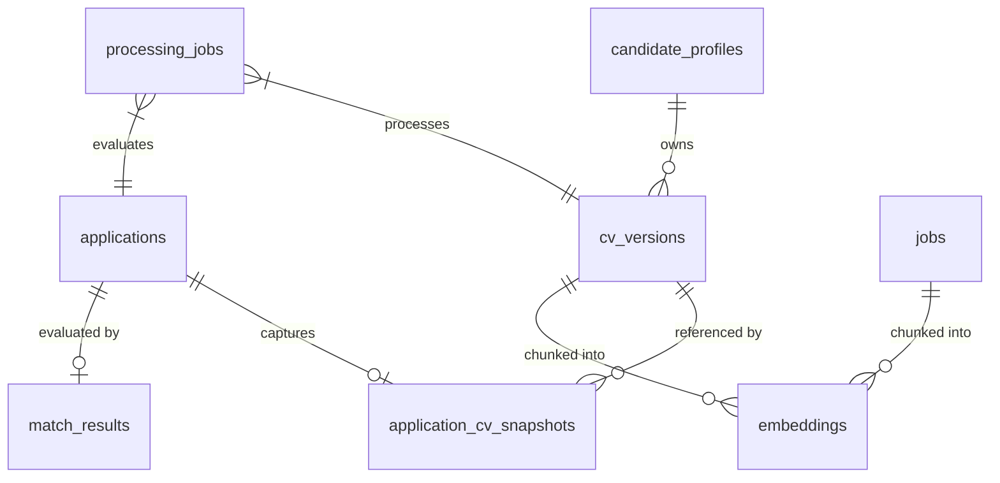
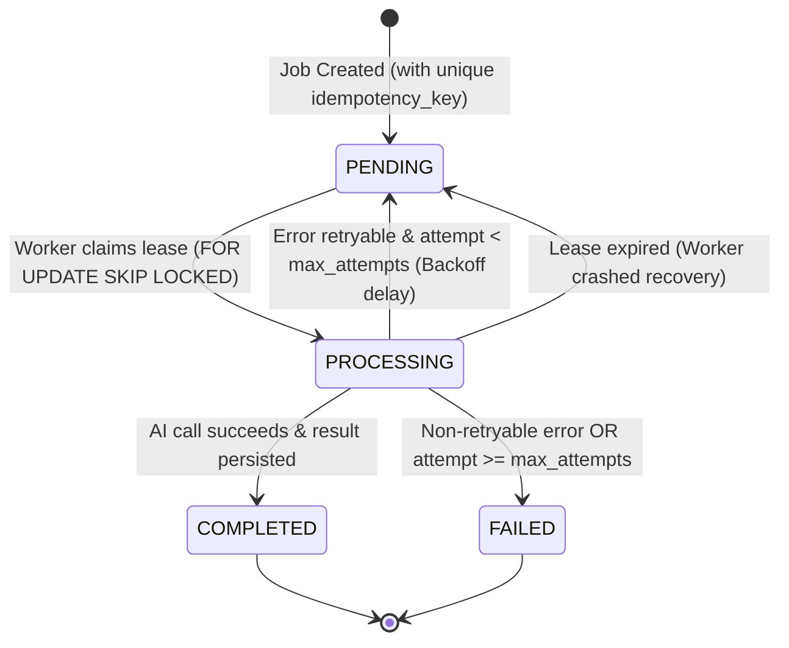

# MatchaJob – Phase 3 Architectural Design & Integration Blueprint

> **Document Status:** Authoritative Design Specification (Revised & Approved for Implementation)  
> **Author:** Antigravity Engineering (SE347 Core Team)  
> **Repository:** `D:\Khai Van\KhaiVan Data\Dai Hoc\se347\repo`  
> **Target Branch:** `phase3/integrate-backend-db`  
> **Execution Gate:** Post-Merge Baseline Verified & Isolated — Implementation Unlocked  
> **Head Reference Commit:** `553e63f`  

---

## 1. Executive Summary & Architecture Boundaries

This document defines the complete implementation specification for **Phase 3 (Database Schema Integration, AI Worker CV Processing & Matching Pipeline)**.

### 1.1 Strict Ownership & Boundary Rules
- **Upstream Domain Files:** The 19 files introduced from `origin/feature/init-backend-db` (including `Job.java`, `Application.java`, `JobStage.java`, their controllers/services/repositories, and `database/design/schema.sql`) are **READ-ONLY**.
- **Domain Package Isolation:** The incompatible upstream entities (`com.matchajob.api.recruitment.*`) are isolated at the Spring configuration level (`MatchaJobApplication.java`), allowing Phase 2 and Phase 3 infrastructure to run and validate schemas cleanly with `hibernate.ddl-auto: validate` without modifying author files.
- **Phase 2 Infrastructure:** Remained 100% active and healthy: PostgreSQL 16.15 with `pgvector 0.8.7`, HikariCP, Flyway, Actuator, RestClient, and internal Docker networking.

---

## 2. Database Migration Blueprint (Flyway V1, V2, V3+)



### 2.1 Rule: V1 Is Immutable
- `V1__init_extensions.sql` was already applied to the PostgreSQL instances during Phase 2.
- **Invariant:** `V1__init_extensions.sql` MUST NOT be altered. No extensions (`pgcrypto`, `pg_trgm`) may be retroactively inserted into V1.

### 2.2 Rule: V2 Reproduces Team Schema Verbatim
- `V2__baseline_schema.sql` incorporates the full schema semantics from `database/design/schema.sql`:
  - **Required Extensions First:** `CREATE EXTENSION IF NOT EXISTS "pgcrypto";` and `CREATE EXTENSION IF NOT EXISTS "pg_trgm";`.
  - **All 23 Tables:** `users`, `admin_permissions`, `companies`, `company_perks`, `company_members`, `candidate_profiles`, `candidate_skills`, `candidate_work_history`, `categories`, `jobs`, `job_tags`, `saved_jobs`, `applications`, `interviews`, `moderation_reviews`, `reports`, `system_settings`, `audit_logs`, `notifications`, `billing_plans`, `company_subscriptions`, `guides`, `password_reset_tokens`.
  - **Constraints & Indexes:** Primary keys, foreign keys, unique constraints, check constraints, B-tree indexes, BRIN indexes, and Trigram GIN indexes (`gin_trgm_ops`).
  - **Triggers & Views:** `fn_set_updated_at()`, automatic table update triggers, `vw_employer_dashboard`, and `vw_moderation_queue`.
  - **Seed Data:** Default records in `system_settings`.
- `schema.sql` itself remains completely untouched.

### 2.3 Rule: Phase 3 Structures in V3+
`schema.sql` contains zero vector columns and zero AI/CV tables. All new tables belong strictly in `V3__ai_vector_foundation.sql` without duplicating or altering the existing 23 tables.

---

## 3. Phase 3 Relational & Vector Schema Specification (V3)



### 3.1 `cv_versions` (CV Storage & Parsing)
Tracks uploaded binary CV assets, extracted raw text, and structured resume entities per candidate.
```sql
CREATE TABLE cv_versions (
    id              UUID PRIMARY KEY DEFAULT gen_random_uuid(),
    candidate_id    UUID NOT NULL REFERENCES candidate_profiles(id) ON DELETE CASCADE,
    file_path       VARCHAR(500) NOT NULL,
    file_name       VARCHAR(255) NOT NULL,
    file_size_bytes INTEGER NOT NULL,
    mime_type       VARCHAR(100) NOT NULL,
    sha256_hash     VARCHAR(64) NOT NULL,
    raw_text        TEXT,
    parsed_data     JSONB,
    status          VARCHAR(20) NOT NULL DEFAULT 'uploaded'
                    CHECK (status IN ('uploaded', 'extracted', 'failed')),
    created_at      TIMESTAMPTZ NOT NULL DEFAULT now(),
    updated_at      TIMESTAMPTZ NOT NULL DEFAULT now()
);

CREATE INDEX idx_cv_versions_candidate ON cv_versions(candidate_id, created_at DESC);
CREATE INDEX idx_cv_versions_sha256 ON cv_versions(sha256_hash);
```
*Relationship to Existing Schema:* When a new CV version is confirmed active, the backend updates `candidate_profiles.cv_url` with the file download URL, ensuring compatibility with the existing profile view.

### 3.2 `application_cv_snapshots` (Immutable Application Snapshot)
Preserves the exact CV version used when submitting an application without altering upstream `applications`.
```sql
CREATE TABLE application_cv_snapshots (
    id              UUID PRIMARY KEY DEFAULT gen_random_uuid(),
    application_id  UUID NOT NULL REFERENCES applications(id) ON DELETE CASCADE,
    cv_version_id   UUID NOT NULL REFERENCES cv_versions(id) ON DELETE RESTRICT,
    created_at      TIMESTAMPTZ NOT NULL DEFAULT now(),

    CONSTRAINT uq_app_cv_snapshot UNIQUE (application_id)
);

CREATE INDEX idx_app_cv_snapshot_cv ON application_cv_snapshots(cv_version_id);
```
*Relationship to Existing Schema:* Concurrently populates `applications.cv_snapshot_url` with the snapshot URL, maintaining legacy UI contracts while preserving strict relational integrity in `application_cv_snapshots`.

### 3.3 `processing_jobs` (Crash-Safe Async State Machine)
Orchestrates background tasks with explicit lease management, attempt tracking, backoff delay, and idempotency.
```sql
CREATE TABLE processing_jobs (
    id              UUID PRIMARY KEY DEFAULT gen_random_uuid(),
    job_type        VARCHAR(50) NOT NULL
                    CHECK (job_type IN ('CV_TEXT_EXTRACTION', 'CV_EMBEDDING_GENERATION', 'JOB_EMBEDDING_GENERATION', 'APPLICATION_MATCHING')),
    entity_type     VARCHAR(30) NOT NULL
                    CHECK (entity_type IN ('cv_version', 'job', 'application')),
    entity_id       UUID NOT NULL,
    status          VARCHAR(20) NOT NULL DEFAULT 'PENDING'
                    CHECK (status IN ('PENDING', 'PROCESSING', 'COMPLETED', 'FAILED')),
    attempt_count   INTEGER NOT NULL DEFAULT 0,
    max_attempts    INTEGER NOT NULL DEFAULT 3,
    lease_token     VARCHAR(64),
    lease_expires_at TIMESTAMPTZ,
    retry_after     TIMESTAMPTZ NOT NULL DEFAULT now(),
    last_error      TEXT,
    idempotency_key VARCHAR(100) NOT NULL,
    started_at      TIMESTAMPTZ,
    completed_at    TIMESTAMPTZ,
    created_at      TIMESTAMPTZ NOT NULL DEFAULT now(),
    updated_at      TIMESTAMPTZ NOT NULL DEFAULT now(),

    CONSTRAINT uq_processing_idempotency UNIQUE (idempotency_key)
);

CREATE INDEX idx_processing_jobs_ready ON processing_jobs (status, retry_after)
    WHERE status IN ('PENDING', 'FAILED');
CREATE INDEX idx_processing_jobs_lease ON processing_jobs (status, lease_expires_at)
    WHERE status = 'PROCESSING';
```

### 3.4 `embeddings` (Strict 1536-Dimensional Dense Vectors)
Stores dense vector representations for CV chunks and job requirement sections.
```sql
CREATE TABLE embeddings (
    id              UUID PRIMARY KEY DEFAULT gen_random_uuid(),
    entity_type     VARCHAR(30) NOT NULL CHECK (entity_type IN ('cv_version', 'job')),
    entity_id       UUID NOT NULL,
    chunk_index     INTEGER NOT NULL DEFAULT 0,
    chunk_text      TEXT NOT NULL,
    embedding       vector(1536) NOT NULL,
    created_at      TIMESTAMPTZ NOT NULL DEFAULT now(),

    CONSTRAINT uq_entity_chunk UNIQUE (entity_type, entity_id, chunk_index)
);

CREATE INDEX idx_embeddings_lookup ON embeddings(entity_type, entity_id);

-- Cosine Distance HNSW Index for sub-millisecond similarity queries (<=>)
CREATE INDEX idx_embeddings_hnsw ON embeddings USING hnsw (embedding vector_cosine_ops)
    WITH (m = 16, ef_construction = 64);
```
*Vector Dimension Invariant:* Exactly **1536 dimensions**. Vectors of different dimensionality are rejected immediately at validation time with HTTP 422 / `IllegalArgumentException`. No silent padding or truncation.

### 3.5 `match_results` (Deterministic & AI Match Output)
Stores computed match scores and transparent evaluation rationale.
```sql
CREATE TABLE match_results (
    id                  UUID PRIMARY KEY DEFAULT gen_random_uuid(),
    application_id      UUID NOT NULL REFERENCES applications(id) ON DELETE CASCADE,
    job_id              UUID NOT NULL REFERENCES jobs(id) ON DELETE CASCADE,
    cv_version_id       UUID NOT NULL REFERENCES cv_versions(id) ON DELETE CASCADE,
    overall_score       SMALLINT NOT NULL CHECK (overall_score BETWEEN 0 AND 100),
    skills_score        SMALLINT CHECK (skills_score BETWEEN 0 AND 100),
    experience_score    SMALLINT CHECK (experience_score BETWEEN 0 AND 100),
    breakdown           JSONB NOT NULL DEFAULT '{}'::jsonb,
    rationale           TEXT,
    created_at          TIMESTAMPTZ NOT NULL DEFAULT now(),

    CONSTRAINT uq_match_application UNIQUE (application_id)
);

CREATE INDEX idx_match_results_job ON match_results(job_id, overall_score DESC);
```

---

## 4. Asynchronous State Machine & Transaction Rules

### 4.1 State Machine Lifecycle & Crash Recovery



### 4.2 Lease Recovery & Anti-Zombie Invariant
- When a worker claims a job, it sets `lease_expires_at = now() + INTERVAL '120 seconds'` and generates a unique `lease_token`.
- If the worker crashes mid-flight, a scheduled recovery sweep (`RECOVER_STUCK_JOBS`) queries:
  ```sql
  UPDATE processing_jobs
  SET status = 'PENDING', lease_token = NULL, retry_after = now()
  WHERE status = 'PROCESSING' AND lease_expires_at < now() AND attempt_count < max_attempts;
  ```
  Jobs whose leases have expired are safely reclaimed without manual database intervention.

### 4.3 Mandatory Database Transaction Decoupling (Anti-Starvation Rule)

> [!CAUTION]
> **HikariCP Protection:** Under no circumstances may a Spring `@Transactional` boundary span an HTTP invocation to the AI Worker.

1. **Transaction A (Claim Lease - < 5ms):**
   ```sql
   SELECT * FROM processing_jobs
   WHERE (status = 'PENDING' AND retry_after <= now())
   ORDER BY retry_after ASC LIMIT 1 FOR UPDATE SKIP LOCKED;
   
   UPDATE processing_jobs
   SET status = 'PROCESSING', started_at = now(), attempt_count = attempt_count + 1,
       lease_token = :token, lease_expires_at = now() + INTERVAL '120 seconds'
   WHERE id = :id;
   ```
2. **Outside Transaction (Network IO):**
   Execute `POST /api/v1/cv/extract` or `POST /api/v1/embeddings` via `AiWorkerClient` with configured read timeout (60 seconds).
3. **Transaction B (Save Results - < 15ms):**
   In a fresh short transaction, persist parsed data to `cv_versions` or `embeddings`, and update `processing_jobs` to `COMPLETED` (or schedule retry if failed).

---

## 5. CV Transport, File Limits & AI Worker Ingestion

### 5.1 Protocol: Multipart HTTP Streaming
```
Client --multipart--> Backend (Validates limits & magic bytes)
                      Backend stores binary on local storage (/var/matchajob/uploads/cv/{uuid})
                      Backend async worker streams multipart --> AI Worker POST /api/v1/cv/extract
                      AI Worker extracts in-memory --> Returns normalized JSON
```

### 5.2 Strict File Ingestion Limits
- **Maximum Size:** 10 MB (`10,485,760` bytes).
- **Supported MIME Types & Extensions:**
  - `application/pdf` (`.pdf`)
  - `application/vnd.openxmlformats-officedocument.wordprocessingml.document` (`.docx`)
- **Magic Bytes Validation:**
  - PDF must begin with `%PDF-` (`0x25 0x50 0x44 0x46`).
  - DOCX must begin with PK zip header `PK\x03\x04` (`0x50 0x4B 0x03 0x04`).
- **Pathological Protection:**
  - PDF: Maximum 20 pages (rejects billion-page bombs).
  - Sanitization: Strips null bytes (`\x00`), controls UTF-8 replacement errors, limits raw text to 500,000 characters.

### 5.3 AI Worker Libraries
- `python-multipart`: Streaming form parsing.
- `pypdf`: Fast text extraction from PDF streams.
- `python-docx`: Document body and table extraction from `.docx`.

---

## 6. AI Provider Strategy & Deterministic Test Provider

### 6.1 Multi-Provider Architecture
The AI Worker abstracts LLM and embedding generation behind `AIProvider`:
- `test`: Deterministic, offline, zero-network, zero API key.
- `openai`: `text-embedding-3-small` (1536d) + `gpt-4o-mini`.
- `gemini`: `text-embedding-004` + `gemini-1.5-flash`.

### 6.2 Deterministic Test Provider (`AI_PROVIDER=test`)
- **Cryptographic Vector Derivation:**
  Instead of Python's randomized `hash()`, uses `hashlib.sha256(text.encode('utf-8')).digest()` to seed coordinate generation:
  $$\text{seed} = \text{int.from\_bytes}(\text{sha256}(chunk)[:8], \text{'big'})$$
  Coordinates $v_i = \sin\left(\text{seed} \times 0.001 \times (i + 1)\right)$ for $i \in [0, 1535]$.
  The vector is normalized to unit Euclidean length ($\|\vec{v}\|_2 = 1.0$), ensuring identical cosine similarity across separate processes and operating systems.
- **Structured Parsing:**
  Extracts candidate entities deterministically based on standard regex and token scanning.
- **Match Scoring:**
  Computes deterministic scores based on token Jaccard similarity and keyword presence.

---

## 7. REST API Contracts

### 7.1 Backend Endpoints (`server.servlet.context-path=/api`)

#### `POST /api/v1/candidates/{candidateId}/cv`
- **Request:** `multipart/form-data`, parameter `file`.
- **Response `202 Accepted`:**
  ```json
  {
    "cv_version_id": "c1a0c442-98fc-1c14-9afb-4c8996fb9211",
    "candidate_id": "9b1deb4d-3b7d-4bad-9bdd-2b0d7b3dcb6d",
    "file_name": "candidate_cv.pdf",
    "file_size_bytes": 245120,
    "status": "uploaded",
    "processing_job_id": "e3b0c442-98fc-1c14-9afb-4c8996fb9242",
    "message": "CV uploaded and queued for processing."
  }
  ```

#### `GET /api/v1/candidates/{candidateId}/cv/{cvVersionId}`
- **Response `200 OK`:**
  ```json
  {
    "id": "c1a0c442-98fc-1c14-9afb-4c8996fb9211",
    "candidate_id": "9b1deb4d-3b7d-4bad-9bdd-2b0d7b3dcb6d",
    "file_name": "candidate_cv.pdf",
    "status": "extracted",
    "parsed_data": {
      "full_name": "Nguyen Van A",
      "email": "nguyenvana@example.com",
      "skills": ["Java", "Spring Boot", "PostgreSQL"]
    },
    "created_at": "2026-10-08T09:30:00Z"
  }
  ```

#### `POST /api/v1/applications/{applicationId}/match`
- **Response `202 Accepted`:**
  ```json
  {
    "application_id": "d4b0c442-98fc-1c14-9afb-4c8996fb9255",
    "processing_job_id": "b8b0c442-98fc-1c14-9afb-4c8996fb9266",
    "status": "PENDING"
  }
  ```

#### `GET /api/v1/applications/{applicationId}/match`
- **Response `200 OK`:**
  ```json
  {
    "application_id": "d4b0c442-98fc-1c14-9afb-4c8996fb9255",
    "overall_score": 88,
    "skills_score": 92,
    "experience_score": 85,
    "breakdown": {
      "required_skills_matched": ["Java", "Spring Boot", "PostgreSQL"]
    },
    "rationale": "Candidate possesses strong backend competencies matching the role requirements."
  }
  ```

### 7.2 AI Worker Endpoints (`http://ai-worker:8000`)
- `POST /api/v1/cv/extract` (multipart `file` $\to$ `raw_text`, `parsed_data`, `char_count`).
- `POST /api/v1/embeddings` (JSON `{"texts": [...]}` $\to$ `{"embeddings": [[...1536 floats...]], "dimension": 1536}`).
- `POST /api/v1/match/score` (JSON `{"job_title": "...", "job_requirements": "...", "cv_text": "..."}` $\to$ `{"overall_score": 88, ...}`).
- `GET /health` & `GET /health/ready`.

---

## 8. Client Timeouts & Idempotency Rules

### 8.1 Distinct Timeouts in `AiWorkerClient`
- **Health & Readiness Probes:**
  `connect_timeout = 3000ms`, `read_timeout = 5000ms`.
- **CV Extraction & Inference:**
  `connect_timeout = 3000ms`, `read_timeout = 60000ms` (configurable via `ai-worker.processing-timeout-ms`).

### 8.2 Idempotency Invariants
- `processing_jobs.idempotency_key` ensures that re-triggering an upload or match for the same entity does not duplicate jobs.
- `embeddings` uses unique constraint `(entity_type, entity_id, chunk_index)` to prevent duplicate chunk storage.
- `match_results` uses unique constraint `(application_id)` to ensure one definitive match per application.

---

## 9. Authentication & Security Assumptions for Phase 3

As platform authentication is not yet integrated:
- In dev/test profile, user identity is supplied via request headers (`X-Candidate-Id`, `X-User-Id`) or path variables.
- Production guards will replace these headers with JWT claims without altering the underlying CV and matching domain services.
