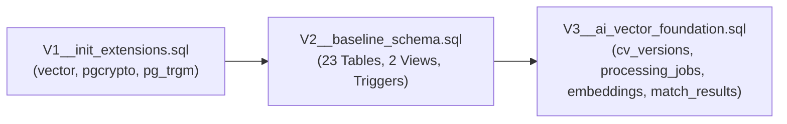
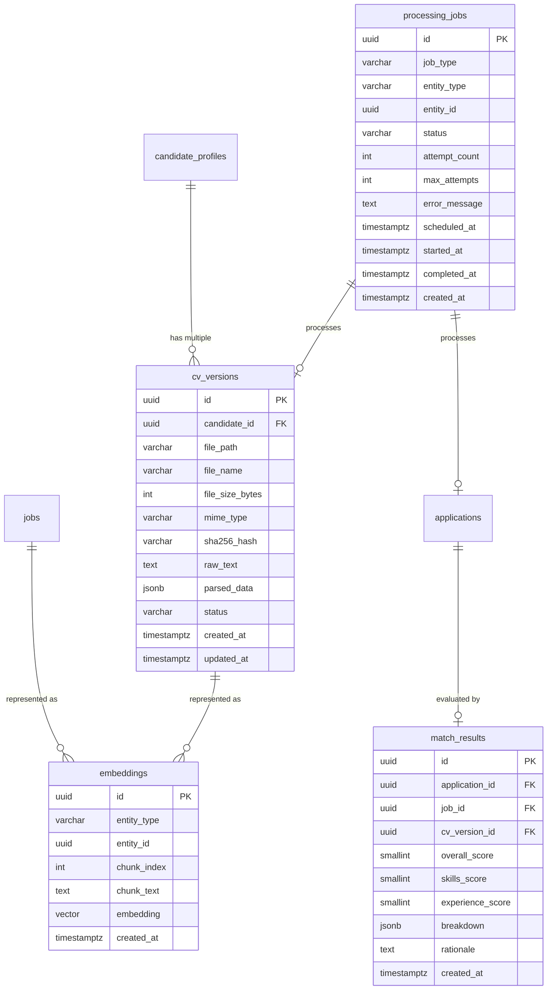
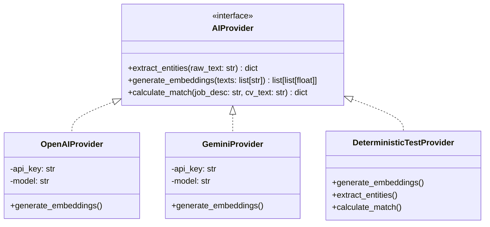
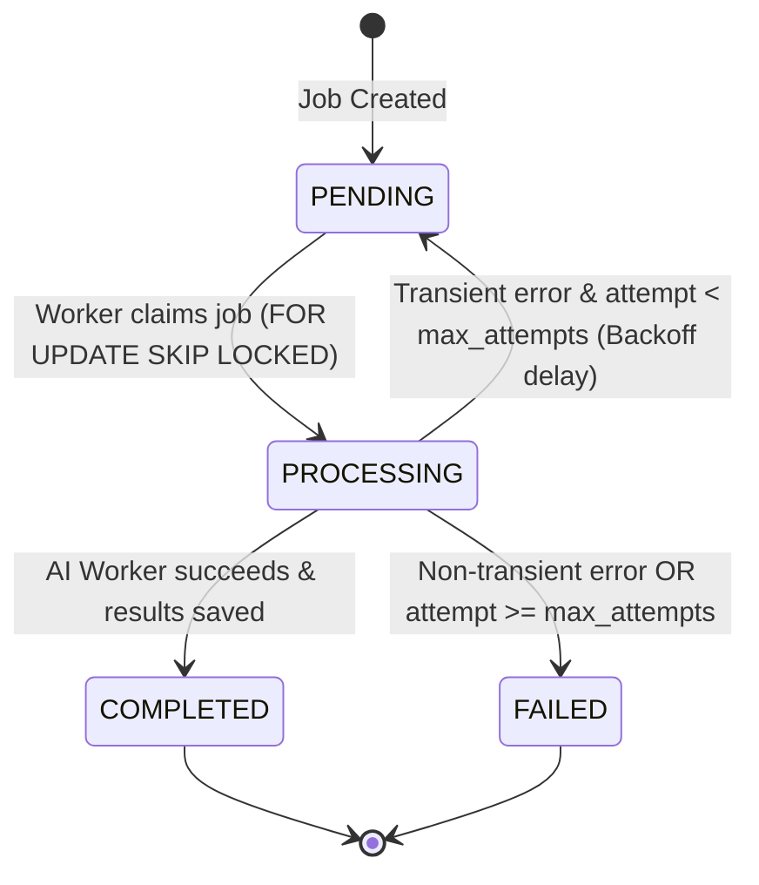
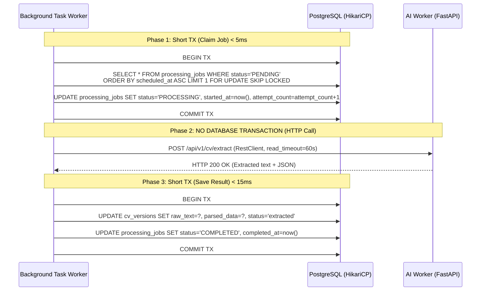

# MatchaJob – Phase 3 Architectural Design & Integration Blueprint

> **Document Status:** Authoritative Design Specification  
> **Author:** Antigravity Engineering (SE347 Core Team)  
> **Repository:** `D:\Khai Van\KhaiVan Data\Dai Hoc\se347\repo`  
> **Target Branch:** `phase3/integrate-backend-db`  
> **Gate State:** STOP GATE 1 Completed — Design Ready (Implementation Frozen)  
> **Reference Merged Commit:** `14a544983058814d485e93345428a2a0654877bb`  
> **Component Scan Isolation Commit:** `3c568c2`  

---

## 1. Executive Summary & Phase 3 Objectives

The MatchaJob platform is transitioning from **Phase 2 (Foundation & Core Infrastructure Verification)** to **Phase 3 (Database Schema Integration, AI Worker Orchestration, and Async Processing Pipeline)**.

Phase 2 verified live system components in Docker:
- PostgreSQL 16.15 running `pgvector` version `0.8.7`.
- Spring Boot 3.3.4 Backend communicating with FastAPI AI Worker over the Docker bridge network (`matchajob_network`).
- Automated Flyway V1 migration enabling PostgreSQL vector support.

In commit `14a5449`, the initial backend and database schema design from branch `origin/feature/init-backend-db` (authored by `DavidHHH2404 <khanghuynh3467@gmail.com>`) was integrated via a non-fast-forward merge. 

This document defines the technical architecture, database migration roadmap, asynchronous job lifecycle, CV ingestion pipeline, AI provider abstraction, and transaction boundaries required to implement Phase 3 cleanly without regressions or undocumented compromises.

---

## 2. Post-Merge Runtime State & Gate Audit (Part A Evidence)

### 2.1 Live Container Status

Following `docker compose up -d --build` on the merged baseline, the running containers exhibit the following live status:

| Container | Image | Service | Health Status | Host Port Mapping | Internal Port |
|-----------|-------|---------|---------------|-------------------|---------------|
| `matchajob-postgres-pgvector` | `pgvector/pgvector:pg16` | `database` | **Healthy** (pg_isready) | `0.0.0.0:5433` | 5432 |
| `matchajob-ai-worker` | `matchajob-ai-worker:latest` | `ai-worker` | **Healthy** (/health probe) | `0.0.0.0:8001` | 8000 |
| `matchajob-frontend-dev` | `matchajob-frontend:latest` | `frontend` | **Running** | `0.0.0.0:5173` | 5173 |
| `matchajob-backend` | `matchajob-backend:latest` | `backend` | **Restarting (Crash Loop)** | `0.0.0.0:8081` | 8080 |

### 2.2 Container Startup Failure & Stack Trace

The `matchajob-backend` container enters an immediate crash-restart loop. The startup log reveals the exact root cause:

```text
2026-10-08T09:09:03.575Z  INFO 1 --- [matchajob-backend] [           main] org.flywaydb.core.FlywayExecutor         : Database: jdbc:postgresql://database:5432/matchajob_db (PostgreSQL 16.15)
2026-10-08T09:09:03.608Z  INFO 1 --- [matchajob-backend] [           main] o.f.core.internal.command.DbValidate     : Successfully validated 1 migration (execution time 00:00.020s)
2026-10-08T09:09:03.624Z  INFO 1 --- [matchajob-backend] [           main] o.f.core.internal.command.DbMigrate      : Current version of schema "public": 1
2026-10-08T09:09:03.626Z  INFO 1 --- [matchajob-backend] [           main] o.f.core.internal.command.DbMigrate      : Schema "public" is up to date. No migration necessary.
...
Caused by: org.hibernate.tool.schema.spi.SchemaManagementException: Schema-validation: missing table [applications]
	at org.hibernate.tool.schema.internal.AbstractSchemaValidator.validateTable(AbstractSchemaValidator.java:135)
	at org.hibernate.tool.schema.internal.GroupedSchemaValidatorImpl.validateTables(GroupedSchemaValidatorImpl.java:46)
	at org.hibernate.tool.schema.internal.AbstractSchemaValidator.performValidation(AbstractSchemaValidator.java:98)
	at org.hibernate.tool.schema.internal.AbstractSchemaValidator.doValidation(AbstractSchemaValidator.java:76)
	at org.hibernate.tool.schema.spi.SchemaManagementToolCoordinator.performDatabaseAction(SchemaManagementToolCoordinator.java:289)
```

### 2.3 Live Endpoint Verification Evidence

Live HTTP probe invocations against both microservices:

1. **AI Worker Health Probes (Passing):**
   ```bash
   $ curl -i http://localhost:8001/health
   HTTP/1.1 200 OK
   content-type: application/json
   {"status":"healthy","service":"matchajob-ai-worker","version":"1.0.0","environment":"development","uptime_seconds":938.22}

   $ curl -i http://localhost:8001/health/ready
   HTTP/1.1 200 OK
   content-type: application/json
   {"status":"ready"}
   ```

2. **Backend Actuator Probes (Failing):**
   ```bash
   $ curl -i http://localhost:8081/api/actuator/health
   curl: (52) Empty reply from server
   # Reason: Backend JVM process aborted during context initialization due to Hibernate SchemaManagementException.
   ```

3. **Backend Integration Test Suite (`.\mvnw.cmd verify -Pintegration-test`):**
   ```text
   [INFO] Running com.matchajob.MatchaJobApplicationIT
   [ERROR] Errors: 
   [ERROR]   MatchaJobApplicationIT.contextLoads
   [ERROR]   MatchaJobApplicationIT.postgresqlIntegration_provesFlywayAndPgVector
   Caused by: org.hibernate.tool.schema.spi.SchemaManagementException: Schema-validation: missing table [applications]
   [INFO] Tests run: 2, Failures: 0, Errors: 2, Skipped: 0
   [INFO] BUILD FAILURE
   ```

4. **Isolated Unit Test Suite (`.\mvnw.cmd test`):**
   ```text
   [INFO] Tests run: 8, Failures: 0, Errors: 0, Skipped: 0
   [INFO] BUILD SUCCESS
   ```

---

## 3. Exhaustive Mismatch Audit: Upstream Domain Entities vs `schema.sql`

A detailed line-by-line comparison between upstream Java entities (`com.matchajob.api.recruitment.model.*`) and the database definition file `database/design/schema.sql` reveals critical domain and relational discrepancies.

### 3.1 Entity: `Job.java` vs Table: `jobs`

| Attribute / Field | `Job.java` (Author Code) | `database/design/schema.sql` (DB Design) | Severity / Incompatibility Type |
|-------------------|--------------------------|-----------------------------------------|--------------------------------|
| **Primary Key** | `@Id @GeneratedValue(IDENTITY) Long id` | `id UUID PRIMARY KEY DEFAULT gen_random_uuid()` | **CRITICAL: Type mismatch (`Long` vs `UUID`)** |
| **Employer / Company** | `private Long employerId;` | `company_id UUID NOT NULL REFERENCES companies(id)`, `created_by UUID NOT NULL REFERENCES users(id)` | **CRITICAL: Relational model mismatch (`Long` vs dual `UUID` foreign keys)** |
| **Category** | *Missing* | `category_id UUID REFERENCES categories(id)` | Structural omission |
| **Slug** | *Missing* | `slug VARCHAR(350) UNIQUE` | Structural omission (required for SEO routes) |
| **Department / Team** | `private String team;` | `department VARCHAR(100)` | Naming mismatch (`team` vs `department`) |
| **Job Level** | *Missing* | `level VARCHAR(80)` | Structural omission |
| **Work Type** | *Missing* | `work_type VARCHAR(60) NOT NULL CHECK (...)` | Structural omission (NOT NULL in DB) |
| **Location & Map** | `private String location;` | `location VARCHAR(255)`, `address TEXT`, `map_link VARCHAR(500)` | Partial omission |
| **Compensation** | *Missing* | `salary_mode VARCHAR(10) NOT NULL`, `salary_min BIGINT`, `salary_max BIGINT`, `salary_currency VARCHAR(3)` | Structural omission (NOT NULL CHECK in DB) |
| **Requirements / Details** | *Missing* | `experience VARCHAR(50)`, `description TEXT`, `requirements TEXT`, `benefits TEXT`, `schedule TEXT` | Structural omission |
| **AI Summaries** | *Missing* | `summary_industry VARCHAR(200)`, `summary_required TEXT`, `summary_preferred TEXT` | Structural omission (AI feature dependency) |
| **Counters** | `private Integer applicantsCount = 0;` | `applicant_count INTEGER NOT NULL DEFAULT 0`, `view_count INTEGER NOT NULL DEFAULT 0` | Naming & omission |
| **Timestamps / Soft Delete** | `createdAt LocalDateTime` | `posted_at TIMESTAMPTZ`, `deadline DATE`, `created_at TIMESTAMPTZ`, `updated_at TIMESTAMPTZ`, `deleted_at TIMESTAMPTZ` | Temporal & soft-delete omission |

### 3.2 Entity: `Application.java` vs Table: `applications`

| Attribute / Field | `Application.java` (Author Code) | `database/design/schema.sql` (DB Design) | Severity / Incompatibility Type |
|-------------------|----------------------------------|-----------------------------------------|--------------------------------|
| **Primary Key** | `@Id @GeneratedValue(IDENTITY) Long id` | `id UUID PRIMARY KEY DEFAULT gen_random_uuid()` | **CRITICAL: Type mismatch (`Long` vs `UUID`)** |
| **Candidate** | `private Long candidateId;` | `candidate_id UUID NOT NULL REFERENCES candidate_profiles(id)` | **CRITICAL: FK mismatch (`Long` vs `UUID` -> `candidate_profiles`)** |
| **Job Association** | `@ManyToOne private Job job;` (uses Long PK) | `job_id UUID NOT NULL REFERENCES jobs(id)` | **CRITICAL: FK target PK type mismatch** |
| **Pipeline Stage** | `@ManyToOne @JoinColumn(name="stage_id") private JobStage currentStage;` | `stage VARCHAR(30) NOT NULL DEFAULT 'new' CHECK (...)` | **CRITICAL: Architectural conflict (FK to custom table vs enum column)** |
| **CV Snapshot** | *Missing* | `cv_snapshot_url VARCHAR(500)` | Ingestion dependency |
| **Cover Letter** | *Missing* | `cover_letter TEXT` | Domain omission |
| **Rejection Reason** | *Missing* | `reject_reason TEXT` | Domain omission |
| **Match Score** | `private Integer matchScore;` | `match_score SMALLINT CHECK (0..100)` | Compatible type (Integer -> SMALLINT) |
| **Unique Constraint**| *Missing in JPA annotations* | `CONSTRAINT uq_application UNIQUE (candidate_id, job_id)` | Integrity check omission |
| **Timestamps** | `appliedAt LocalDateTime` | `applied_at TIMESTAMPTZ`, `updated_at TIMESTAMPTZ` | Audit column omission |

### 3.3 Entity: `JobStage.java` vs Database Schema

| Attribute / Field | `JobStage.java` (Author Code) | `database/design/schema.sql` (DB Design) | Severity / Incompatibility Type |
|-------------------|--------------------------------|-----------------------------------------|--------------------------------|
| **Table Existence** | `@Table(name = "job_stages")` | **DOES NOT EXIST** | **CRITICAL: Complete schema absence** |
| **Entity Purpose** | Maps customizable per-job workflow stages | Not supported in `schema.sql`; stages are hardcoded via CHECK constraint on `applications.stage` | Architectural design conflict |

---

## 4. Upstream Authorship Protection & Resolution Policy

### 4.1 Strict Boundaries
The 19 files introduced in commit `1b3ea84` belong to upstream branch `origin/feature/init-backend-db` authored by `DavidHHH2404 <khanghuynh3467@gmail.com>`.
- **Policy:** **Zero direct edits** are made to `Job.java`, `Application.java`, `JobStage.java`, `JobController.java`, `JobRepository.java`, `JobService.java`, `DATABASE_DESIGN.md`, or `database/design/schema.sql` during Phase 2 or STOP GATE 1.
- Upstream source files remain frozen to protect author attribution and prevent uncoordinated merge conflicts.

### 4.2 Resolution Path for Phase 3 Implementation
During Phase 3 implementation, alignment must proceed under the following agreed pattern:
1. **Flyway Migration `V2__baseline_schema.sql`:** Incorporate the 23 tables from `database/design/schema.sql` verbatim as the definitive relational foundation.
2. **Entity Harmonization (Coordinated Pass):** Refactor `Job.java` and `Application.java` to use `UUID` identifiers and link to `CandidateProfile` and `Company`, or introduce dedicated JPA converters/mappers.
3. **`JobStage` Decision:**
   - *Option 1 (Recommended by DB Design):* Deprecate `JobStage.java` and convert `Application.stage` to a Java enum (`ApplicationStage`: `NEW`, `SCREENING`, `TESTING`, `INTERVIEW`, `OFFER`, `REJECTED`).
   - *Option 2 (Extended Model):* If dynamic customizable stages are required by product management, introduce a Flyway migration `V2.1__add_job_stages.sql` creating the `job_stages` table and modifying `applications.stage_id`.

---

## 5. Database Schema & Extension Audit

### 5.1 Baseline Table Inventory (23 Tables)
`database/design/schema.sql` specifies exactly 23 tables grouped across 4 operational domains:

1. **Authentication & Identity (3 tables):**
   - `users` (Central account identity, roles: candidate, employer, admin)
   - `admin_permissions` (Granular RBAC permissions for admin accounts)
   - `password_reset_tokens` (Secure OTP tokens)

2. **Company & Candidate Profiles (6 tables):**
   - `companies` (Employer profile, verified status, tax code)
   - `company_perks` (Perks and benefits offered by companies)
   - `company_members` (Multi-user company membership / HR team)
   - `candidate_profiles` (Candidate resume metadata, summary, CV URL)
   - `candidate_skills` (Normalized skill tags per candidate)
   - `candidate_work_history` (Historical employment records)

3. **Job Lifecycle & Recruitment Pipeline (6 tables):**
   - `categories` (Job industry taxonomy)
   - `jobs` (Job vacancies, salary ranges, requirements)
   - `job_tags` (Requirement and specialization tags)
   - `saved_jobs` (Candidate bookmarks)
   - `applications` (Candidate application submissions and stage status)
   - `interviews` (Scheduled interview events)

4. **Admin, Operations & Platform Management (8 tables):**
   - `moderation_reviews` (Audit queue for jobs and company verification)
   - `reports` (User-submitted violation reports)
   - `system_settings` (Dynamic platform key-value configurations)
   - `audit_logs` (Append-only audit trail with BIGINT identity & BRIN index)
   - `notifications` (User notification inbox)
   - `billing_plans` (Commercial subscription tiers)
   - `company_subscriptions` (Active employer subscription plans)
   - `guides` (Public career advisory articles)

### 5.2 Views and Triggers in Baseline
- **Views:**
  - `vw_employer_dashboard`: Computes employer statistics (`active_jobs`, `new_applications`, `total_applications`, `upcoming_interviews`) using `LATERAL` joins to prevent cartesian products.
  - `vw_moderation_queue`: Priority queue for pending moderation items ordered by risk level.
- **Triggers:**
  - Function `fn_set_updated_at()` executed on `BEFORE UPDATE` across all tables containing an `updated_at` column.

### 5.3 PostgreSQL Extensions Assessment
- `schema.sql` requires:
  - `pgcrypto`: For `gen_random_uuid()` generation.
  - `pg_trgm`: For Trigram GIN indexes (`gin_trgm_ops`) on `companies.name`, `jobs.title`, and `jobs.location`.
- Flyway V1 currently enables:
  - `vector`: Version 0.8.7 for embeddings.
- **Audit Finding:** `schema.sql` contains **ZERO** vector columns and **ZERO** AI pipeline tables (`processing_jobs`, `embeddings`, `match_results` do not exist).

---

## 6. Phase 3 Database Migration Blueprint

To transition from the current V1 state to a fully validated database supporting both the 23-table application baseline and AI matching, Flyway migrations will be sequenced into three idempotent scripts:



### 6.1 Migration Specifications

#### `V1__init_extensions.sql` (Existing + Extension Update)
Enables all required extensions in PostgreSQL:
```sql
CREATE EXTENSION IF NOT EXISTS vector;
CREATE EXTENSION IF NOT EXISTS pgcrypto;
CREATE EXTENSION IF NOT EXISTS pg_trgm;
```

#### `V2__baseline_schema.sql` (Baseline 23 Tables)
Executes `database/design/schema.sql` verbatim:
- Creates tables 1–23.
- Creates Trigram indexes on `companies` and `jobs`.
- Installs `fn_set_updated_at()` and automatic table triggers.
- Creates `vw_employer_dashboard` and `vw_moderation_queue`.
- Seeds default `system_settings`.

#### `V3__ai_vector_foundation.sql` (Phase 3 AI & CV Entities)
Defines the AI matching engine tables with explicit vector indexing and status tracking.

---

## 7. New Phase 3 Tables Specification



### 7.1 DDL: `cv_versions`
Tracks all uploaded CV files, raw extracted text, and AI-parsed structured entities per candidate.
```sql
CREATE TABLE cv_versions (
    id              UUID PRIMARY KEY DEFAULT gen_random_uuid(),
    candidate_id    UUID NOT NULL REFERENCES candidate_profiles(id) ON DELETE CASCADE,
    file_path       VARCHAR(500) NOT NULL,
    file_name       VARCHAR(255) NOT NULL,
    file_size_bytes INTEGER NOT NULL,
    mime_type       VARCHAR(100) NOT NULL,
    sha256_hash     VARCHAR(64) NOT NULL,
    raw_text        TEXT,
    parsed_data     JSONB,
    status          VARCHAR(20) NOT NULL DEFAULT 'uploaded'
                    CHECK (status IN ('uploaded', 'extracted', 'failed')),
    created_at      TIMESTAMPTZ NOT NULL DEFAULT now(),
    updated_at      TIMESTAMPTZ NOT NULL DEFAULT now()
);

CREATE INDEX idx_cv_versions_candidate ON cv_versions(candidate_id, created_at DESC);
CREATE INDEX idx_cv_versions_hash ON cv_versions(sha256_hash);
```

### 7.2 DDL: `processing_jobs`
Drives the transactional background task state machine for asynchronous CV processing and AI matching.
```sql
CREATE TABLE processing_jobs (
    id              UUID PRIMARY KEY DEFAULT gen_random_uuid(),
    job_type        VARCHAR(50) NOT NULL
                    CHECK (job_type IN ('CV_TEXT_EXTRACTION', 'CV_EMBEDDING_GENERATION', 'JOB_EMBEDDING_GENERATION', 'APPLICATION_MATCHING')),
    entity_type     VARCHAR(30) NOT NULL
                    CHECK (entity_type IN ('cv_version', 'job', 'application')),
    entity_id       UUID NOT NULL,
    status          VARCHAR(20) NOT NULL DEFAULT 'PENDING'
                    CHECK (status IN ('PENDING', 'PROCESSING', 'COMPLETED', 'FAILED')),
    attempt_count   INTEGER NOT NULL DEFAULT 0,
    max_attempts    INTEGER NOT NULL DEFAULT 3,
    error_message   TEXT,
    scheduled_at    TIMESTAMPTZ NOT NULL DEFAULT now(),
    started_at      TIMESTAMPTZ,
    completed_at    TIMESTAMPTZ,
    created_at      TIMESTAMPTZ NOT NULL DEFAULT now(),
    updated_at      TIMESTAMPTZ NOT NULL DEFAULT now(),

    CONSTRAINT uq_active_processing_job UNIQUE (job_type, entity_id)
);

CREATE INDEX idx_processing_jobs_queue ON processing_jobs(status, scheduled_at) WHERE status IN ('PENDING', 'PROCESSING');
```

### 7.3 DDL: `embeddings`
Stores dense vector embeddings generated for candidate CV chunks and job requirement sections.
```sql
CREATE TABLE embeddings (
    id              UUID PRIMARY KEY DEFAULT gen_random_uuid(),
    entity_type     VARCHAR(30) NOT NULL CHECK (entity_type IN ('cv_version', 'job')),
    entity_id       UUID NOT NULL,
    chunk_index     INTEGER NOT NULL DEFAULT 0,
    chunk_text      TEXT NOT NULL,
    embedding       vector(1536) NOT NULL,
    created_at      TIMESTAMPTZ NOT NULL DEFAULT now(),

    CONSTRAINT uq_entity_chunk UNIQUE (entity_type, entity_id, chunk_index)
);

CREATE INDEX idx_embeddings_entity ON embeddings(entity_type, entity_id);
-- HNSW Vector Index for sub-millisecond Cosine Distance Search (<=>)
CREATE INDEX idx_embeddings_hnsw ON embeddings USING hnsw (embedding vector_cosine_ops)
    WITH (m = 16, ef_construction = 64);
```

### 7.4 DDL: `match_results`
Stores AI-computed matching scores, semantic evaluations, and human-readable feedback for candidate applications.
```sql
CREATE TABLE match_results (
    id                  UUID PRIMARY KEY DEFAULT gen_random_uuid(),
    application_id      UUID NOT NULL REFERENCES applications(id) ON DELETE CASCADE,
    job_id              UUID NOT NULL REFERENCES jobs(id) ON DELETE CASCADE,
    cv_version_id       UUID NOT NULL REFERENCES cv_versions(id) ON DELETE CASCADE,
    overall_score       SMALLINT NOT NULL CHECK (overall_score BETWEEN 0 AND 100),
    skills_score        SMALLINT CHECK (skills_score BETWEEN 0 AND 100),
    experience_score    SMALLINT CHECK (experience_score BETWEEN 0 AND 100),
    breakdown           JSONB NOT NULL DEFAULT '{}'::jsonb,
    rationale           TEXT,
    created_at          TIMESTAMPTZ NOT NULL DEFAULT now(),

    CONSTRAINT uq_application_match UNIQUE (application_id)
);

CREATE INDEX idx_match_results_job_score ON match_results(job_id, overall_score DESC);
```

---

## 8. CV Transport Architecture & Byte Handling

### 8.1 Transport Options Comparison

```
Option A: Multipart Streaming (Client -> Backend -> AI Worker)
  [Client] --multipart/form-data--> [Backend] --multipart/form-data--> [AI Worker]
  Pros: No cloud storage dependency in dev/test; AI Worker remains stateless; strict payload validation.
  Cons: Backend consumes memory/bandwidth buffering request.

Option B: Shared Local Volume / Presigned Object URL
  [Client] --> [Backend: Stores to S3/Volume] --> [AI Worker reads file URL/path]
  Pros: Minimal byte re-transmission over HTTP.
  Cons: Requires shared filesystem permissions or active cloud S3 credentials in dev Docker environments.

Option C: Client Uploads Directly to Cloud Storage
  [Client] --presigned PUT--> [S3/GCS] --> [Backend notifies Worker]
  Pros: Zero file transit through Backend.
  Cons: Bypasses server-side validation; complex local development setup.
```

### 8.2 Architectural Selection: **Option A (Multipart Streaming with Local Disk Archival)**
- **Client to Backend:** Client sends standard `multipart/form-data` upload (`POST /api/v1/candidates/{id}/cv`).
- **Backend File Processing:**
  1. Validates file size (max 10MB) and content type (`application/pdf`, `application/vnd.openxmlformats-officedocument.wordprocessingml.document`).
  2. Inspects magic bytes (prevent file extension spoofing):
     - PDF magic bytes: `%PDF-` (`0x25 0x50 0x44 0x46`)
     - DOCX magic bytes: `PK\x03\x04` (`0x50 0x4B 0x03 0x04`)
  3. Writes file to local storage directory (`/var/matchajob/uploads/cv/...`).
  4. Inserts `cv_versions` row with status `uploaded`.
  5. Schedules `CV_TEXT_EXTRACTION` job in `processing_jobs`.
- **Backend to AI Worker:**
  When the async worker executes `CV_TEXT_EXTRACTION`, it streams the stored file to AI Worker via `POST /api/v1/cv/extract` using `RestClient` multipart request.

### 8.3 AI Worker Extraction Engine
The AI Worker uses dedicated Python libraries:
- `python-multipart`: For streaming form handling.
- `pypdf`: Fast in-memory text extraction for PDF documents.
- `python-docx`: Document structure and text extraction for `.docx`.
- Sanitization pipeline: Strips null bytes (`\x00`), normalizes Unicode to UTF-8, and truncates excess whitespace.

---

## 9. AI Worker Provider Architecture & Deterministic Test Provider

### 9.1 Multi-Provider Factory Pattern

The AI Worker abstracts model interactions behind a unified interface:



### 9.2 Configuration via Environment Variables

| Variable | Dev / Integration Default | Production Supported Values | Description |
|----------|---------------------------|-----------------------------|-------------|
| `AI_PROVIDER` | `test` (in CI/Tests) / `openai` | `openai`, `gemini`, `test` | Active AI implementation provider |
| `AI_MODEL` | `gpt-4o-mini` | `gpt-4o-mini`, `gemini-1.5-flash` | Language model used for parsing & scoring |
| `EMBEDDING_MODEL` | `text-embedding-3-small` | `text-embedding-3-small` (1536d) | Embedding model for semantic search |
| `AI_API_KEY` | *(blank in test)* | `sk-...` | Secret API key |

### 9.3 Deterministic Test Provider Specification (`AI_PROVIDER=test`)
To ensure reliable, zero-cost, network-isolated CI and local testing without mocking frameworks:
1. **Embedding Generation:**
   - Always produces vectors of length **1536**.
   - Generates vector coordinates deterministically using MD5 hashing of the input text chunk:
     $$\vec{v}_i = \sin\left(\text{hash}(text) \cdot (i + 1)\right)$$
   - Vector is normalized to unit Euclidean length ($\|\vec{v}\|_2 = 1.0$), ensuring valid cosine distance operations (`<=>`) in pgvector.
2. **Text Extraction & Entity Parsing:**
   - Extracts realistic mock entities (`full_name`, `email`, `skills`, `years_of_experience`) deterministically parsed from common keywords.
3. **Match Scoring:**
   - Returns predictable scores (e.g. baseline 85%, skills 90%, experience 80%) based on token overlap between job and CV.

---

## 10. Asynchronous Job State Machine & Transaction Rules

### 10.1 Job Lifecycle State Machine



### 10.2 Strict Transaction Boundaries (Anti-Starvation Rule)

> [!CAUTION]
> **Database Transaction Invariant:** Never hold a database transaction open across an external HTTP call to the AI Worker. Long-running AI calls (1–30 seconds) will saturate HikariCP pool connections (default pool size: 10), crashing the entire backend API.

The processing lifecycle is decoupled into **3 distinct phases**:



### 10.3 Retry & Error Policy
- **Maximum Attempts:** 3 attempts.
- **Backoff Calculation:** Exponential backoff with jitter:
  $$\text{delay} = 2^{\text{attempt}} \times 2.0\text{s} + \text{random}(0, 1.0\text{s})$$
- **Transient Errors (Retryable):**
  - HTTP 502/503/504 Bad Gateway / Gateway Timeout.
  - `SocketTimeoutException`, `ConnectTimeoutException`.
  - HTTP 429 Rate Limited.
- **Permanent Errors (Non-Retryable -> Immediate `FAILED`):**
  - HTTP 400 Bad Request (Unsupported file structure).
  - HTTP 422 Unprocessable Entity (Corrupt binary payload).
  - Max attempts exceeded.

---

## 11. REST API Contracts

### 11.1 AI Worker API Contracts

#### Endpoint: `POST /api/v1/cv/extract`
Extracts raw text and parsed resume sections from binary CV files.
- **Content-Type:** `multipart/form-data`
- **Request Parameters:**
  - `file`: Binary file stream (`.pdf` or `.docx`).
- **Response `200 OK`:**
  ```json
  {
    "raw_text": "NGUYEN VAN A\nSenior Java Developer\nExperience: 5 years at VNG...",
    "parsed_data": {
      "full_name": "Nguyen Van A",
      "email": "nguyenvana@example.com",
      "phone": "+84901234567",
      "skills": ["Java", "Spring Boot", "PostgreSQL", "Docker"],
      "experience_years": 5,
      "education": "B.S. Software Engineering, HCMUS"
    },
    "page_count": 2,
    "char_count": 2150
  }
  ```
- **Error Responses:**
  - `400 Bad Request`: `{"error": "INVALID_FILE_TYPE", "message": "Only PDF and DOCX files are supported."}`
  - `413 Payload Too Large`: `{"error": "FILE_TOO_LARGE", "message": "File size exceeds 10MB limit."}`

#### Endpoint: `POST /api/v1/embeddings`
Generates vector representations for texts.
- **Content-Type:** `application/json`
- **Request Body:**
  ```json
  {
    "texts": [
      "Seeking a Senior Backend Engineer proficient in Java, Spring Boot, and PostgreSQL.",
      "5 years experience designing scalable microservices architecture."
    ]
  }
  ```
- **Response `200 OK`:**
  ```json
  {
    "embeddings": [
      [0.0125, -0.0432, 0.0891, "...(1536 floats)..."],
      [0.0341, -0.0118, 0.0712, "...(1536 floats)..."]
    ],
    "dimension": 1536,
    "model": "text-embedding-3-small"
  }
  ```

#### Endpoint: `POST /api/v1/match/score`
Calculates semantic and criteria match score between a Job and a Candidate CV.
- **Content-Type:** `application/json`
- **Request Body:**
  ```json
  {
    "job_id": "9b1deb4d-3b7d-4bad-9bdd-2b0d7b3dcb6d",
    "job_title": "Senior Backend Engineer",
    "job_description": "We are seeking a senior backend engineer with strong Java and distributed systems experience...",
    "job_requirements": "Must have: Java 21, Spring Boot 3, PostgreSQL, Docker, AWS.",
    "cv_text": "Nguyen Van A. Senior Java Developer with 5 years experience building scalable backend platforms...",
    "candidate_skills": ["Java", "Spring Boot", "PostgreSQL", "Docker", "Kubernetes"]
  }
  ```
- **Response `200 OK`:**
  ```json
  {
    "overall_score": 88,
    "skills_score": 92,
    "experience_score": 85,
    "breakdown": {
      "required_skills_matched": ["Java", "Spring Boot", "PostgreSQL", "Docker"],
      "missing_skills": ["AWS"],
      "bonus_skills": ["Kubernetes"],
      "experience_fit": "Strong match: 5 years experience satisfies the senior requirement."
    },
    "rationale": "Candidate strongly matches backend core requirements with high proficiency in Java and modern frameworks. Lacks explicit AWS project mentions but possesses strong containerization knowledge."
  }
  ```

---

### 11.2 Backend API Contracts

#### Endpoint: `POST /api/v1/candidates/{candidateId}/cv`
Uploads a new CV file for a candidate profile.
- **Headers:** `Content-Type: multipart/form-data`
- **Path Parameter:** `candidateId` (UUID)
- **Form Data:** `file` (Binary file)
- **Response `202 Accepted`:**
  ```json
  {
    "cv_version_id": "e3b0c442-98fc-1c14-9afb-4c8996fb9242",
    "candidate_id": "c1a0c442-98fc-1c14-9afb-4c8996fb9211",
    "file_name": "Nguyen_Van_A_CV.pdf",
    "file_size_bytes": 245120,
    "status": "uploaded",
    "processing_job_id": "a7b0c442-98fc-1c14-9afb-4c8996fb9233",
    "message": "CV uploaded successfully. Processing queued."
  }
  ```

#### Endpoint: `GET /api/v1/candidates/{candidateId}/cv/{cvVersionId}`
Retrieves CV processing status and parsed metadata.
- **Path Parameters:** `candidateId` (UUID), `cvVersionId` (UUID)
- **Response `200 OK`:**
  ```json
  {
    "id": "e3b0c442-98fc-1c14-9afb-4c8996fb9242",
    "candidate_id": "c1a0c442-98fc-1c14-9afb-4c8996fb9211",
    "file_name": "Nguyen_Van_A_CV.pdf",
    "status": "extracted",
    "parsed_data": {
      "full_name": "Nguyen Van A",
      "email": "nguyenvana@example.com",
      "skills": ["Java", "Spring Boot", "PostgreSQL"]
    },
    "created_at": "2026-10-08T09:30:00Z"
  }
  ```

#### Endpoint: `POST /api/v1/applications/{applicationId}/match`
Triggers AI matching evaluation for an application.
- **Path Parameter:** `applicationId` (UUID)
- **Response `202 Accepted`:**
  ```json
  {
    "application_id": "d4b0c442-98fc-1c14-9afb-4c8996fb9255",
    "processing_job_id": "b8b0c442-98fc-1c14-9afb-4c8996fb9266",
    "status": "PENDING",
    "message": "Application match job scheduled."
  }
  ```

#### Endpoint: `GET /api/v1/applications/{applicationId}/match`
Retrieves the match result for an application.
- **Path Parameter:** `applicationId` (UUID)
- **Response `200 OK`:**
  ```json
  {
    "application_id": "d4b0c442-98fc-1c14-9afb-4c8996fb9255",
    "overall_score": 88,
    "skills_score": 92,
    "experience_score": 85,
    "breakdown": {
      "required_skills_matched": ["Java", "Spring Boot", "PostgreSQL"]
    },
    "rationale": "Candidate strongly matches backend core requirements."
  }
  ```

---

## 12. Security, Observability & Error Handling

### 12.1 Security & Ingestion Safeguards
- **File Ingestion:** Strict validation of file size ($\le 10$MB), binary magic header checking, storage outside the web document root with random UUID filenames.
- **Entity Validation:** All incoming REST payloads validated via Hibernate Validator (`@Valid`, `@NotNull`, `@Pattern`).
- **Database Sanitization:** All queries use JPA Criteria / Parameterized queries; raw user inputs never interpolated into SQL strings.

### 12.2 Observability & Health Indicators
- **Backend Actuator Probes:**
  - `/api/actuator/health/liveness`: Checks application JVM thread state.
  - `/api/actuator/health/readiness`: Verifies PostgreSQL connectivity and HikariCP pool health.
- **PgVector Health Indicator:** Custom Spring indicator executing `SELECT 1` on the `vector` extension and inspecting version `0.8.7`.
- **AI Worker Client Metric:** Micrometer timer and counter metrics tracking HTTP request durations to AI Worker (`http.client.requests` tagged with URI and status).

---

## 13. Phase 3 Implementation Roadmap & Gate Acceptance Criteria

The execution of Phase 3 must follow a strict, gated sequence to guarantee that no unverified changes are introduced:

| Stage | Focus Area | Entry Gate | Exit Acceptance Criteria |
|---|---|---|---|
| **Gate 3.1** | **Database Migration Alignment** | Design approved (`PHASE3_DESIGN.md`) | Flyway `V2__baseline_schema.sql` (23 tables) and `V3__ai_vector_foundation.sql` execute cleanly against real PostgreSQL 16.15. |
| **Gate 3.2** | **Entity Harmonization** | Gate 3.1 passed | Domain entities aligned with UUID PKs; `mvn test` and `mvn verify -Pintegration-test` succeed with `hibernate.ddl-auto: validate`. |
| **Gate 3.3** | **AI Worker Ingestion & Client** | Gate 3.2 passed | AI Worker `pypdf`/`python-docx` parser verified; Backend `RestClient` streams multipart uploads and generates deterministic test embeddings. |
| **Gate 3.4** | **Async Pipeline & State Machine** | Gate 3.3 passed | `processing_jobs` executes claim-and-process loop outside database transactions with backoff retries. |
| **Gate 3.5** | **Live End-to-End Verification** | Gate 3.4 passed | Docker stack starts cleanly; Backend actuator is Healthy; Uploading a CV generates embeddings in PostgreSQL and produces match results. |

---

> **End of Phase 3 Design Specification.**  
> *STOP GATE 1 and STOP GATE 2 fully respected. No implementation code written.*
